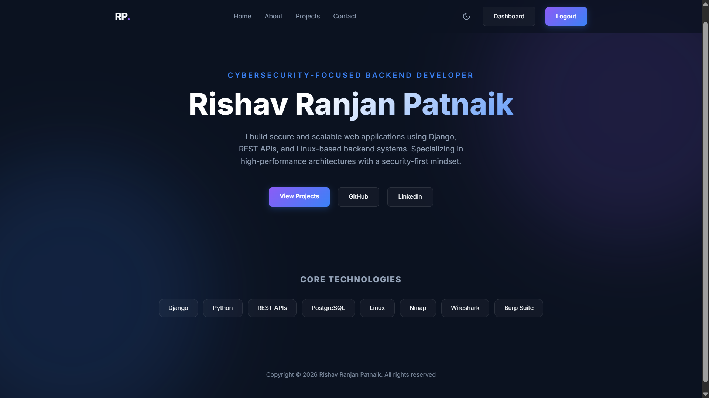
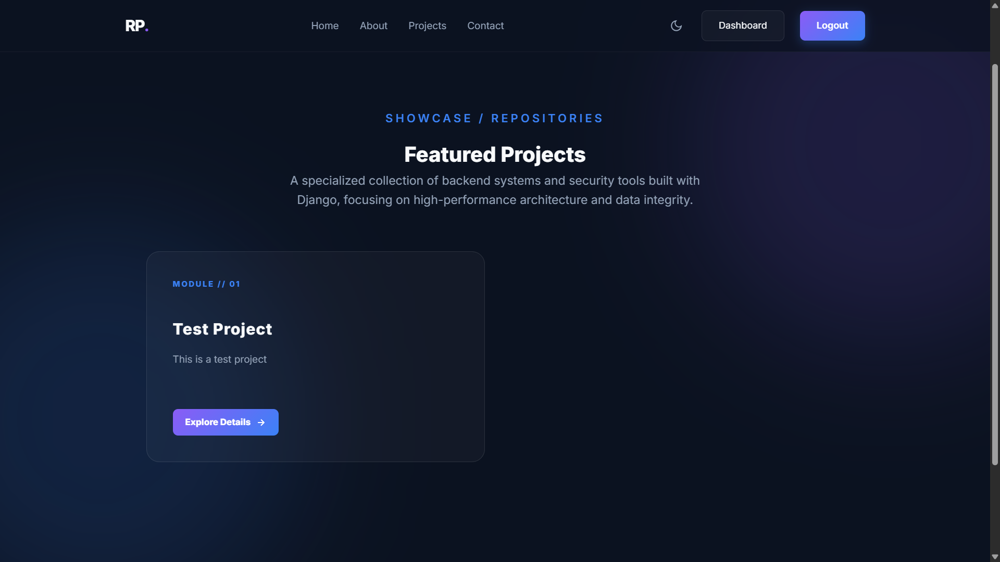
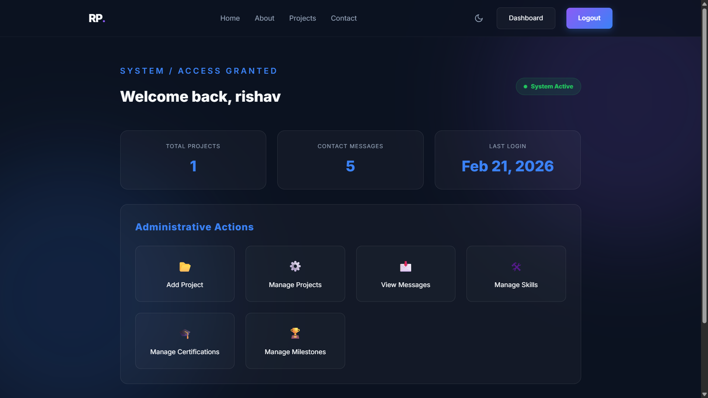
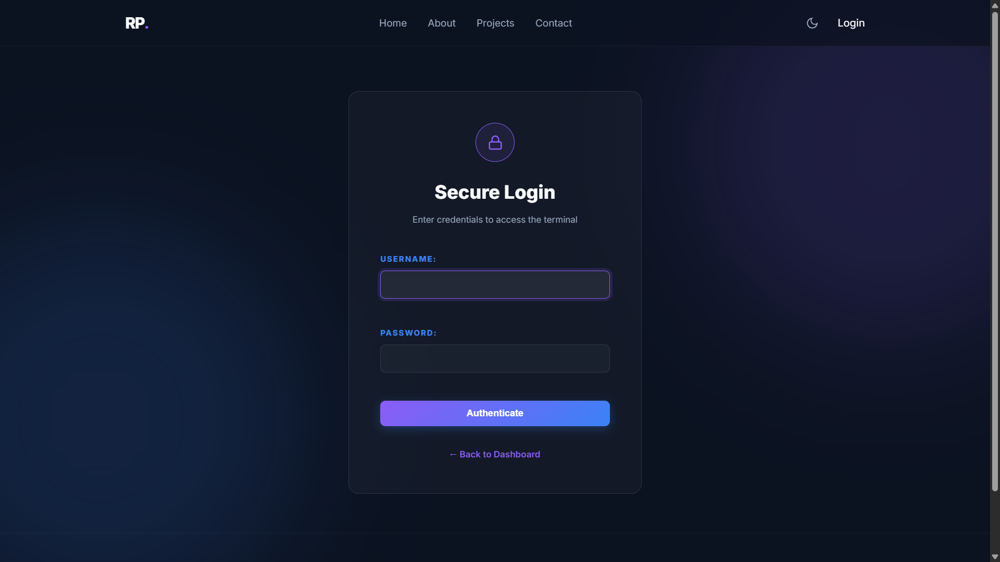
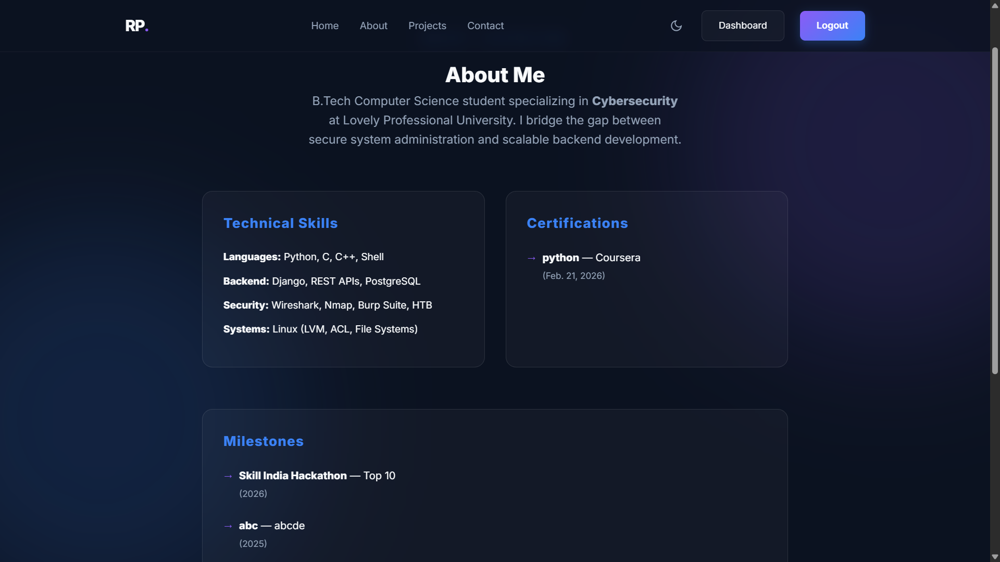

# 🚀 Django Portfolio

A full-stack Django portfolio application with a custom CMS dashboard, secure environment configuration, and PostgreSQL integration.

This project is designed to demonstrate backend architecture, authentication systems, admin-level content management, and production-ready configuration practices.

---

## ✨ Features

- 🔐 Custom Authentication System
- 🧑‍💻 Admin Dashboard (Non-default Django Admin)
- 📂 Project Management (Add / Edit / Delete)
- 🛠 Skills Management
- 🎓 Certifications Management
- 🏆 Milestones Management
- 📩 Contact Form with Email Integration
- 🗄 PostgreSQL Database
- 🌗 Dark/Light Theme Toggle
- 🔒 Environment Variable Security (.env)
- 📦 Production-Structured Settings

---

## 🛠 Tech Stack

- **Backend:** Django 5
- **Database:** PostgreSQL
- **Frontend:** HTML, CSS (Custom Glass UI)
- **Authentication:** Django Auth
- **Environment Management:** python-decouple / dotenv
- **Deployment Ready:** Yes

---

## 📁 Project Structure

accounts/ → Authentication & Dashboard
core/ → Main pages & CMS models
projects/ → Project models & views
portfolio/ → Main settings & URL config
templates/ → HTML templates
static/ → CSS & static assets

---

## ⚙️ Local Setup

### 1️⃣ Clone Repository

git clone https://github.com/rishav-patnaik/Django-Portfolio.git

cd Django-Portfolio

### 2️⃣ Create Virtual Environment

python -m venv .venv

source .venv/bin/activate # macOS/Linux
.venv\Scripts\activate # Windows

### 3️⃣ Install Dependencies

pip install -r requirements.txt

### 4️⃣ Create `.env` File

Create a `.env` file in the root directory:

SECRET_KEY=your_secret_key
DEBUG=True
DB_NAME=portfolio_db
DB_USER=portfolio_user
DB_PASSWORD=your_password
DB_HOST=localhost
DB_PORT=5432

### 5️⃣ Apply Migrations

python manage.py migrate

### 6️⃣ Create Superuser

python manage.py createsuperuser

### 7️⃣ Run Development Server

python manage.py runserver

---

## 🔐 Production Notes

- `DEBUG=False` in production
- `ALLOWED_HOSTS` configured
- Environment variables secured
- No secrets committed to GitHub

---

## 📸 Screenshots

### 🏠 Home Page

### 📂 Projects Page

### 📊 Dashboard

### 🔐 Login Page

### 📩 Contact Page

### 👤 About Page

---

## 🌍 Deployment

Ready for deployment on:

- Render
- Railway
- Docker (Optional)
- Any WSGI-supported host

---

## 📄 License

This project is for educational and portfolio purposes.